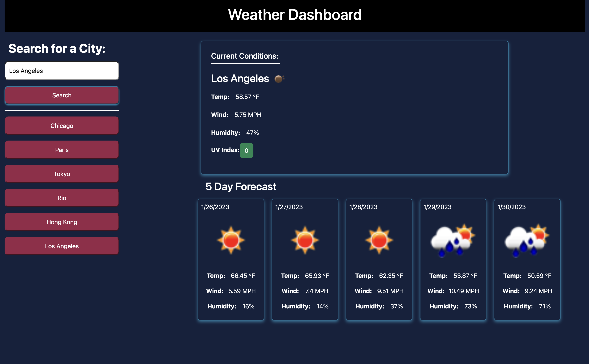

# Weather Dashboard

## Introduction
This project is a result of our bootcamp's week 6 homework assignment. Students were expected to create a weather generator that would store search results to local storage and display current and five-day forecast conditions. The project can be found [here](https://graycodesnu.github.io/weather-dashboard/).

## Goals 
The goal of this assignment was to create a weather dashboard that would meet the below criteria:

+ When a user searches for a city, they are presented with current and future conditions for that city, which is stored in local storage
+ Display the UV index and indicate the current conditions with color
+ Provide a five-day forecast for the city the user inputs
+ A user can return to their previous searches by clicking on the city stached in local storage, which will once again display the conditions for that city 

## Results 
After starting over once, I was able to leverage the foundation I've developed since Week 6 of the course. I ran into quite a few bugs because I originally had several variables and classes with very similar names, but once I was able to sort that out, most features of the app worked well. 

The main thing I struggled with while building this app is getting the stached cities in local storage to re-display the results. Otherwise, most of the bugs I had were a result of my careless naming method and not reading the API docs as thoroughly as I should have the first time. Lessons learned! 